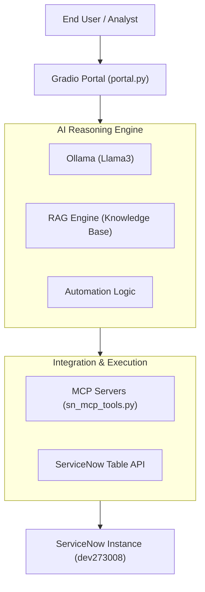

# TEE Project: AI-Driven Service Desk Architecture

This document outlines the functional and strategic approach of the AI Service Desk, as required for the TEE evaluation.

## 1. High-Level Architecture

The system is designed with a **Modular AI Core** that separates reasoning from execution.

## 2. Component Breakdown

| Component | Responsibility | Technology |
|---|---|---|
| **End-User UI** | Ticket creation, live status tracking, and strategic dashboard. | Gradio (Python) |
| **Reasoning Engine** | One-sentence professional summaries, intelligent classification. | Ollama + Llama3 |
| **RAG Retrieval** | Enhancing tickets with local knowledge base articles (10 scenario context). | Python JSON Engine |
| **Automation Engine** | Diagnostics and self-healing (Password resets, VPN restart, Smart Locker). | Logic-based Python |
| **Integration Layer** | Secure communication with ServiceNow for incident lifecycle management. | REST API / MCP |

## 3. The "Thought Process" (Data Flow)

When a user submits a ticket:
1.  **Summarization**: AI converts raw natural language into a professional IT short description.
2.  **Classification**: AI determines Category (Access/Software/etc.) and Assignment Group.
3.  **Context Injection (RAG)**: The system searches `knowledge_base.json` for relevant fix steps and appends them to the internal notes.
4.  **Zero-Touch Check**: If a subcategory matches an automated workflow (e.g., VPN), diagnostics are run.
5.  **ServiceNow Record**: A rich incident is created with all AI reasoning visible to the fulfiller.

---

## 4. Strategic Alignment

This architecture fulfills the **Functional Strategic Approach** requirement by:
-   **Local AI Privacy**: Using Ollama ensures PII never leaves the local network for reasoning.
-   **Low-Level Integration**: Direct ServiceNow API interaction allows for deep field mapping (Categorization/Routing).
-   **Extensibility**: The MCP layer allows for adding new servers (e.g., Jira, Azure DevOps) without refactoring the core logic.
